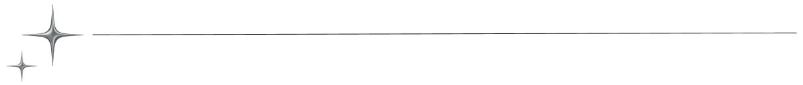
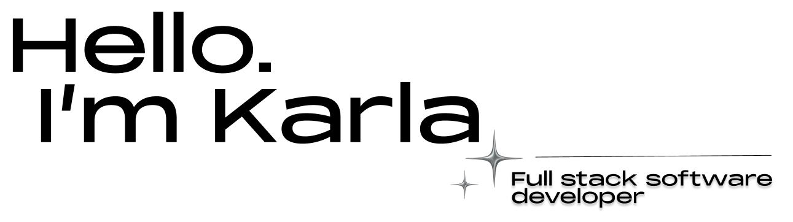

I'm full-stack software developer with a focus on creating responsive, user-friendly applications. This is my personal portfolio, built to showcase my work, skills, and background in both design and development.

[🌐 Visit the live site →](https://karlachuprinski.com) 

<h2 align="center">Tech Stack</h2>

- **Frontend:** React, CSS Modules, AOS (Animations on Scroll)
- **Backend:** Python, Flask, Flask-Mail
- **Deployment:** Vercel (Frontend) + Render (Backend)
- **Other:** reCAPTCHA, GitHub, Responsive Design

<h2 align="center">Features</h2>

- Clean, mobile-responsive layout
- Scroll-based animations for a smooth experience
- Fully functional contact form with reCAPTCHA and email integration
- Custom favicon, SEO tags, and Open Graph metadata
- Organized project showcase with links

<h2 align="center">Contact</h2>

Feel free to reach out via the contact form on the site or connect with me here:

* 📧 [karlachuprinski@gmail.com](mailto:karlachuprinski@gmail.com)
* 💼 [LinkedIn](https://www.linkedin.com/in/karlachuprinski)
* 🗂 [GitHub](https://github.com/kachup1)

> Designed and developed with care by Karla Chuprinski

